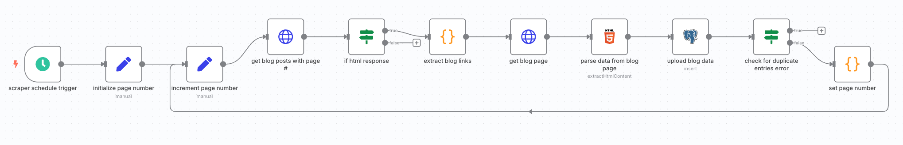
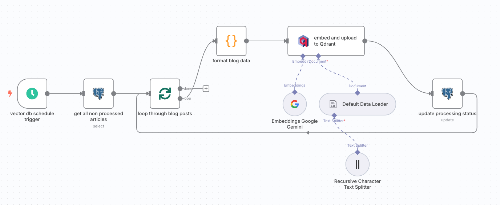
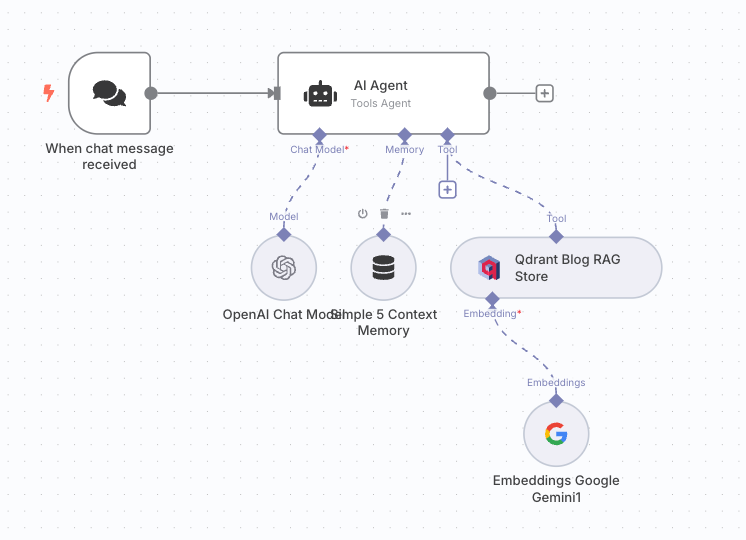

# n8n RAG AI Agent Workflow
This README describes the RAG (Retrieval-Augmented Generation) setup and workflow in n8n for querying a Qdrant vector store with embeddings and generating responses using an LLM.

## Setup

#### 1. Ensure Docker and Docker Compose are Installed
Make sure Docker and Docker Compose are installed on your system:


[Install Docker](https://www.docker.com/products/docker-desktop/)

#### 2. Start the Containers
In the root directory where docker-compose.yml is located, run the following command:

```
docker-compose up -d
```
-d runs the containers in the background.

Docker Compose will automatically create and start the services defined in your docker-compose.yml.

#### 3. Verify Containers Are Running
You can check the status of the containers with:

```
docker-compose ps
```
This will show you the containers’ status and port mappings.

#### 4. Access n8n
Once the containers are up and running, you can access n8n through:

```
http://localhost:5678
```
You’ll be prompted to make an account.

#### 5. Stopping the Containers
When you’re done, you can stop the containers by running:

```
docker-compose down
```
This stops and removes the containers, but keeps your volumes (e.g., data) intact.


### Workflows

1. Bitovi Blog Scraping

2. Storing Blog Post Embeddings in Qdrant

3. LLM Query Generation with Qdrant Vector Store Search


### Overview
This workflow scrapes the Bitovi blog and gathers relevant metadata. Then stores the information into a Postgres database. The next workflow then pulls unprocessed blog posts from the PostgresDB, gets a vector embedding from Google Gemini API, and stores the embeddings in Qdrant. In the final workflow, the user queries OpenAI, the chatbot then retrieves relevant context from the Qdrant vector store, and uses OpenAI's chat model to respond to the user query.


### 1. Bitovi Blog Scraping



First we set a page number to 0, then increment the page number, and begin our loop. We hit the article listings pages, and pull all of the blog post urls from this listings page. Then we verify that we got results from the listings request. If we got listings, we extract the urls, then visit each url and gather relevant data. We then upload the data to Postgres. If there is an error we assume the record has already been uploaded and end the loop otherwise, we increment the page until we hit records we have already uploaded. 

### 2. Storing Blog Post Embeddings in Qdrant



Here, we start by pulling all blog posts from the Postgres DB where the `ìs_processed` column is false. Then we loop through each result, formatting the data into json, embedding the data with Google's API model, storing the data in Qdrant, and finally updating the Postgres processing flag. 

### 3. LLM Query Generation with Qdrant Vector Store Search



This is the final workflow. We start by initiating the agent with a chat message. The chat will gain context from the OpenAI model, the 5 previous context windows, and finally the Qdrant vector store of our blog posts. 


